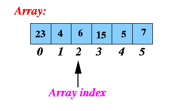
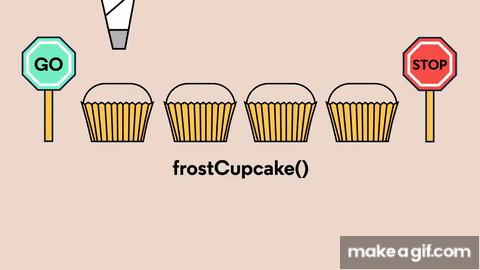
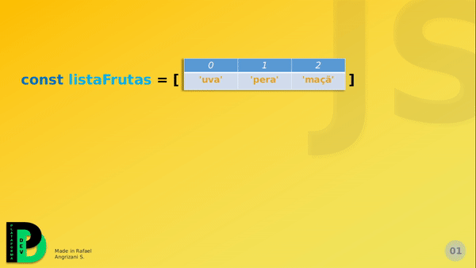
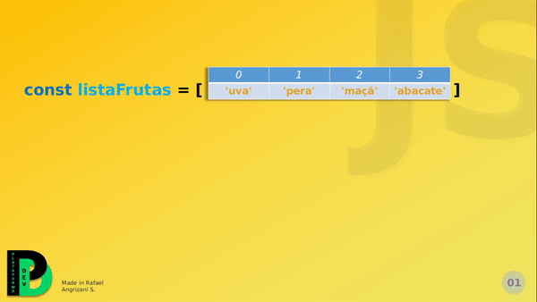
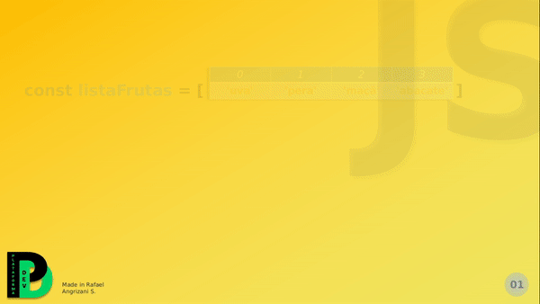
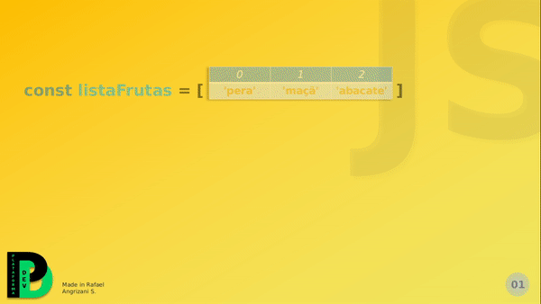
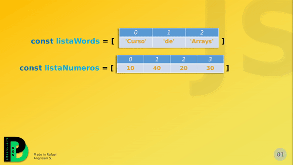
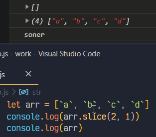
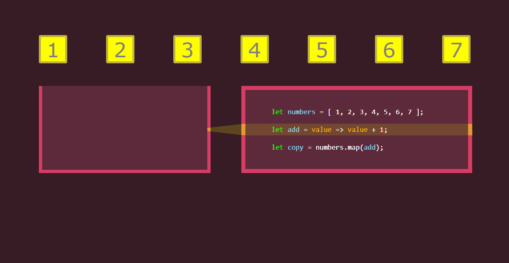

# JavaScript I - Estruturas de Dados, arrays e objetos :)

---
## Instruções Iniciais:


1. Instalem o Node.js na máquina de vocês, na ultima versão disponível do programa: https://nodejs.org/en/

### Façam suas perguntas através do DontPad

[http://dontpad.com/on13-js1](http://dontpad.com/on13-js1)

----
Vamos aprender ou retomar nessa semana:
- [Funções](#function)
- [Estrutura de dados, pra quê?](#estrutura_dados)
- [Arrays (listas) - 𝄞 eu me amarray 𝄞](#arrays)
- [Objetos](#objetos)
- [Iteração / Repetição / Loops](#loops)
- [Alguns métodos de iteração com arrays](#metodo_arrays)
- [Manipulando arrays .map() e as funções com callback](#map)
- [Manipulando arrays .filter()](#filter)
- [Links úteis](#links)
----

<a id="function"></a>

## **1.Functions!**

Uma função é um procedimento de JavaScript - um conjunto de instruções que executa uma tarefa ou calcula um valor. 
 
A sua sintaxe mais comum é essa:

``` Javascript
function soma(param1, param2){
  //ação da minha função
  return param1 + param2;
}

soma(1, 2)
```

Funções dentro de javascript possuem uma declaração(que é onde criamos todos as informações e algoritmos do que queremos que ela execute) e também precisa ter uma chamada `soma(1, 2)` para que seja executada. 

Funções em javascript podem apresentar parâmetros ou não, assim como podem ou não possuir o `return`. Quando usado o return, existe apenas um return por função.

O escopo de funções é uma das formas que nos ajuda a organizar o nosso código javascript com variáveis especificas. Javascript é uma linguagem funcional, portanto veremos funções por todos cantos nessa linguagem.

---
<a id="estrutura_dados"></a>

## **2. Mas, afinal, qual é a importância da estrutura de dados?**

O trabalho de uma pessoa desenvolvedora front-end passa por uma função de extrema importância: o entendimento, manipulação e tratamento de dados.

Um fato que exalta a importância do estudo da estrutura de dados é **a atuação da pessoa desenvolvedora front-end dentro do projeto**. 


Normalmente, a pessoa desenvolvedora back-end desenvolve endpoints que encaminham os dados do banco de dados à pessoa desenvolvedora front-end. Assim, cabe à pessoa desenvolvedora front-end administrar e manipular os dados para serem exibidos na aplicação que está sendo construída, e também tratar os dados que serão enviados ao back-end.


A administração e manipulação dos dados passam pelo entendimento das estruturas de dados e dos métodos que podem ser utilizados para trabalhar com esses dados.

Logo, **Estrutura de Dados - ou *Data Structure* - é um meio de coletar e organizar informações de uma certa forma em que seja possível realizar operações com essas informações de um jeito efetivo.**


---
<a id="arrays"></a>

## **3. Então, o que são Arrays?**

Explicação Concisa: arrays são estruturas de dados que contêm uma lista ordenada de elementos.

```Javascript
const fruits = ['Apple', 'Banana', 'Pear'];

const numbers = [1, 2, 10, -2, -3, 7];
```

Mas, calma. Nós podemos aprofundar essa definição.

Um dos benefícios do array é que ele possibilita que, ao invés de declarar três variáveis diferentes, você pode declarar um array de variáveis:

```Javascript
let sanduicheQueijo = "Queijo";
let sanduichePresunto = "Rosbife";
let sanduicheVegetariano = "Vegetariano";

let sanduiches = ["Queijo", "Presunto", "Vegetariano"];
```

**Arrays são comumente utilizados para organizar dados de uma forma que os seus valores possam ser facilmente encontrados e manipulados.**

Normalmente, os dados armazenados são do mesmo tipo, como `integer` ou `strings`, ou, ainda, `objects` - que veremos mais para frente. Contudo, cabe mencionar que um array pode ser composto por elementos de tipos diversos.

```Javascript
let miscData = [1, "abajur", {index: "zero"}, 7, "beijinho", 5.6]
```

Bom, foi mencionado que o array engloba uma lista **ordenada** de dados. Ele é **ordenado** pois é possível acessar cada elemento através da sua posição dentro de um array:

```Javascript
const fruits = ['Apple', 'Banana', 'Pear'];

console.log(fruits[0]) 
// retorna a primeira posição do array: 'Apple'

const numbers = [1, 2, 10, -2, -3, 7];

console.log(fruits[1]) 
// retorna a segunda posição do array: 2
```

Essa posição é chamada comumente de **index** do elemento no array. E aqui é importante destacar que **a contagem do index** - ou da posição do elemento no array - **sempre se inicia em 0**.



### **Array.length**

Um array é um agrupamento de dados ordenado, onde é possível acessar um elemento de acordo com a sua posição.

Se é possível acessar a um elemento de acordo com a sua posição, logo se conclui que é possível saber quantos elementos existem dentro de um array.

Para isso existe a propriedade `length` -  que mostra o número de elementos contidos dentro de um array.

```Javascript
const clothing = ['shoes', 'shirts', 'socks', 'sweaters'];

console.log(clothing.length); // 4
```

Podemos usa-lo também para realizar uma operação de subtração com o tamanho total do array e, assim, pegar o último elemento de um array:

```Javascript
const clothing = ['shoes', 'shirts', 'socks', 'sweaters'];

console.log(clothing[clothing.length - 1]); // 'sweaters'
```
---
<a id="objetos"></a>

## **4. E os Objetos?**

Objetos também são um agrupamento de dados, mas que são organizados de forma diferente. Isso porque os dados são agrupados **sempre** contendo uma **propriedade** e um **valor**.

Logo, o objeto é sempre uma coleção de propriedades, e uma propriedade é uma associação entre um nome (ou chave) e um valor. Um valor de propriedade pode ser uma função, que é então considerada um método do objeto.

Um ponto importante: **objetos podem compor uma coleção de itens dentro de um array.**

### **Criando um objeto**

```Javascript
const iza = {
  nome: 'Iza',
  idade: 1,
  castrado: true,
  cor: ['branco', 'preto'],
  caracteristica: ['fofinha', 'sociável'],
}

const beyonce = {
  nome: 'Beyoncé',
  idade: 1,
  castrado: true,
  cor: ['amarelo', 'branco', 'marrom', 'dourado'],
  caracteristica: ['brincalhão', 'dengoso'],
}
```

### **Acessando um objeto**

Existem duas formas de acessar um objeto: por meio do *dot notation* ou do *bracket notation*:

```Javascript
//dot notation

  beyonce.nome // Beyoncé
  iza.caracteristica // ['fofinha', 'sociável']

//bracket notarion

  beyonce["idade"] // 1
  iza['castrado'] // true
```

### **Acessando um objeto**

Por padrão, se prefere usar o '.' ou *dot notation*, é mais fácil de ler e mais rápido de escrever. Apenas em alguns caso específicos usamos os *brackets*(colchetes). Por exemplo, quando o array possui objetos como valores, ou quando a propriedade começa com número, ou, ainda, for uma string que tenha mais de um nome (ex: 'thank-you').

```Javascript

const sobrinhosDaVivian = [
  {
    nome: 'Beyoncé',
    idade: 1,
    castrado: true,
    cor: ['amarelo', 'branco', 'marrom', 'dourado'],
    caracteristica: ['brincalhão', 'dengoso'],
  },
  {
    nome: 'Iza',
    idade: 1,
    castrado: true,
    cor: ['branco', 'preto'],
    caracteristica: ['fofinha', 'sociável'],
  }
];

console.log(sobrinhosDaVivian[1].nome) // Iza
console.log(sobrinhosDaVivian[0].caracteristica)// ['brincalhão', 'dengoso'] 
```

---
<a id="loops"></a>

## **5. E como eu faço para obter informações localizadas dentro de um array ou um objeto?**

**Resposta: iteração!**

E o que seria iterar um array? Significa utilizar um método que percorre todos os elementos de um array para realizar operações com ele - seja para pegar um dos valores contidos no array, ordenar os dados em um array para serem exibidos em tela, ou, ainda, para realizar operações matemáticas, dentre outros.

Um dos jeitos de se iterar um array é por meio de um laço (também conhecido como *loop*). *Loops* permitem que você execute um único trecho de código por multiplas vezes, **possuindo sempre uma condição que resulta no seu encerramento, que é checada continuamente**.


### **Tipos de loops**

**1) For**

`For` é a construção de *loop* mais usual. Ela permite que você execute um único trecho de código continuamente, até que se alcance a condição que resulta no seu encerramento.

Ou seja, o `for` possui:

-  um **mecanismo de partida** - um inicializador, que inicia a contagem dos elementos do array 
-  uma **condição de encerramento** da execução do *loop* e que é validada a cada *loop*. É opcional.
-  uma **expressão final**, que será validada no final de cada iteração, para atualizar ou incrementar o contador inicializador.

Sintaxe: 

```Javascript
for ([inicialização]; [condição]; [expressão final]) {
   declaração
}
```

Vamos supor que eu tenha um conjunto de cupcakes que eu precise decorar. No caso, todos os cupcakes estão contidos no array `cupcakes`.

```Javascript
const cupcakes = [cupcake1, cupcake2, cupcake3, ...];
```

Assim, eu criei uma função para decorar os cupcakes, que eu chamei de `frostCupcake()`.

Eu poderia chamar essa função toda vez que um cupcake aparece para ser decorado. Contudo, esse método não funcionaria por muito tempo: além de ser ineficaz, a  quantidade de cupcakes que eu preciso decorar pode mudar e, assim, alguns cupcakes poderiam ficar sem decoração.

**OBS:** Nesse caso, estamos falando de uma repetição de rotina para que todos os cupcakes sejam decorados.

**Função** ----> reusa um conjunto de passos e cria uma rotina

**Loops** ----> repete uma rotina


E aqui que podemos utilizar o `for` para iterar o array `cupcakes` e, assim, garantir que todos os cupcakes serão decorados:



E como esse meu for ficaria no código?

```Javascript
const cupcakes = Array[];

for (const bolinhos = 0; bolinhos < cupcakes.length; bolinhos++) {
   frostCupcake()
}

```
Assim, com esse `for`, eu garanto que todos os meus cupcakes serão decorados.

**2) While**
No `while`, a diferença é que o *loop* ocorrerá até que uma condição deixe de ser verdadeira.

Sintaxe: 

```Javascript
while (condição) {
  rotina
}
```

Ou seja, o `while` é composto por:

-  uma **condição** que será sempre avaliada antes da passagem pelo laço. Se ela for `true`, o laço é executado. Se ela for `false`, a execução do while é finalizada.  
-  uma **rotina**, que será executada enquanto a condição do while for `true`.

Exemplo:

``` Javascript
while (i < 10) {
  text += "The number is " + i;
  i++;
}
```

**3) do...while**

É uma variante do `while`. Aqui, o bloco do loop será executado pelo menos uma vez, mesmo que a condição seja `false`, porque o bloco de código é executado antes da condição ser testada.

``` Javascript
const text = "";
const i = 0;
do {
  text += "The number is " + i;
  i++;
}
while (i < 5);
```

---
<a id="metodo_arrays"></a>

## **6. Métodos de iteração do Array**

Existem vários métodos já prontinhos que o JS nos dá para manipular dados de arrays. Eles são extremamente úteis e muito utilizados diariamente por pessoas desenvolvedoras. 

A lista completa dos métodos é encontrado nesse link: https://developer.mozilla.org/pt-BR/docs/Web/JavaScript/Reference/Global_Objects/Array

Nessa semana, infelizmente, não conseguiremos ver todos os métodos, mas veremos alguns dos métodos mais utilizados.

## Métodos para adicionar e remover elementos

### **a) array.push()**

O método push() adiciona um ou mais elementos ao final de um array e retorna o novo comprimento desse array.



Exemplo de código:

``` Javascript
const numeros = [1, 2, 3];

numeros.push(4);

console.log(numeros); // [1, 2, 3, 4]

numeros.push(5, 6, 7);

console.log(numeros); // [1, 2, 3, 4, 5, 6, 7]
```

### **b) array.pop()**
O método pop remove o último elemento de um array e retorna aquele valor, modificando o tamanho do array.



Exemplo de código:

``` Javascript
const meuPeixe = ['acara-bandeira', 'palhaco', 'mandarim', 'esturjao'];

const meuPeixePop = meuPeixe.pop();

console.log(meuPeixe); // ['acara-bandeira', 'palhaco', 'mandarim' ]

console.log(meuPeixePop); // 'esturjao'

```

### **c) array.shift()**

O método shift()remove o primeiro elemento de um array e retorna esse elemento. Este método também muda o tamanho do array. 



Exemplo de código:

``` Javascript
const array1 = [1, 2, 3];

const firstElement = array1.shift();

console.log(array1);
// expected output: Array [2, 3]

console.log(firstElement);
// expected output: 1

```

### **d) array.unshift()**

O método unshift() adiciona um ou mais elementos no início de um array e retorna o número de elementos (a propriedade `length`) atualizado.



Exemplo de código:

``` Javascript

const arr = [1, 2];

arr.unshift(0); // result of call is 3, the new array length
// arr is [0, 1, 2]

arr.unshift(-2, -1); // = 5
// arr is [-2, -1, 0, 1, 2]

arr.unshift([-3]);
// arr is [[-3], -2, -1, 0, 1, 2]

```
## Métodos para encontrar e ordenar itens de um array

### **a) array.includes()**

O método includes() determina se um array contém um determinado elemento, retornando true ou false apropriadamente.


Exemplo de código:

``` Javascript

const favoriteFoods = ["pizza", "chocolate", "rice and beans"];
favoriteFoods.includes("chocolate") //true
favoriteFoods.includes("watermelon") //false

```

### **b) array.sort()**

O método sort() ordena os elementos do próprio array e retorna o array. 



## Métodos para extrair partes de um array


### **a) array.slice()**

Esse método retorna os elementos selecionados de um array em um novo array. Essa seleção é feita a partir do index dos itens.

**Importante: esse método não remove do array original os elementos selecionados!**

Exemplo de código:

``` Javascript

const fruits = ["Banana", "Orange", "Lemon", "Apple", "Mango"];
var citrus = fruits.slice(1, 3);
console.log(fruits) // Banana, Orange, Lemon, Apple, Mango
console.log(citrus) // Orange, Apple
```


### **b) array.splice()**

Já o splice() é diferente. Ele mexe no conteúdo do array original, adicionando itens novos enquanto remove itens selecionados.

Sintaxe:

``` Javascript
array.splice(indice[, deleteCount[, elemento1[, ...[, elementoN]]]);

```
 1. **indice:** Índice o qual deve iniciar a alterar a lista - ou seja, a partir de qual posição serão acrescentados itens, ou a partir de qual posição serão excluídos itens. 
   
 2. **deleteCount:** indicador de quantos itens devem ser removidos de um array. Se está em 0, então nenhum elemento/item deverá ser removido. É opcional.

 3. **elemento1, ..., elementoN:** Os elementos que serão adicionados no array. É opcional - caso não exista, o splice apenas removerá itens.


Exemplo de código:

``` Javascript

const myFish = ["angel", "clown", "mandarin", "surgeon"];
let removed = myFish.splice(2, 0, "drum");
//myFish é ["angel", "clown", "drum", "mandarin", "surgeon"]
//removed é [], nenhum elemento removido

removed = myFish.splice(3, 1);
//myFish é ["angel", "clown", "drum", "surgeon"]
//removed é ["mandarim"]

removed = myFish.splice(2, 1, "trumpet");
//myFish é ["angel", "clown", "trumpet", "surgeon"]
//removed é ["drum"]

removed = myFish.splice(0, 2, "parrot", "anemone", "blue");
//myFish é ["parrot", "anemone", "blue", "trumpet", "surgeon"]
//removed é ["angel", "clown"]

```

### **slice() x splice()**

Principal diferença: **o `slice()` não alterará o array original!** Ele apenas vai retornar a você um novo array contendo a seleção passada.

Por sua vez, o `splice()` tem o poder tanto de remover elementos, quanto de adicionar novos elementos ao array original.




## Métodos de manipulação do array - ES6

<a id="map"></a>

### **a) array.map()**

Esse talvez seja o método de manipulação de array que você mais utilizará na sua carreira como pessoa desenvolvedora. 

O método map() invoca um callback passada por argumento para cada elemento do Array e devolve um novo Array como resultado.

Sintaxe: 

``` Javascript
arrayOriginal.map(callback)
```

### **Mas o que é esse tal de callback???**

No JavaScript, é possível passar uma função como parâmetro de outra função? Sim, é perfeitamente possível.

Assim, nós podemos passar funções como parâmetros de outras funções e chama-las dentro da própria função. 

Isso fica mais claro no exemplo abaixo:

``` Javascript
const print = (callback) => {  
    callback();
}
```

A função print() usa a função callback() como parâmetro, e a chama dentro de si. Isso é válido no JavaScript e é o que chamamos de "callback". 

Logo, o callback é uma função que deve ser executada depois que uma primeira função é executada.

Esse callback é composto por:

``` Javascript
function(valorAtual, indice, array)
```

- O parâmetro **valorAtual** é obrigatório e representa o nome que eu dei item da iteração atual. Ou seja, à medida que a função map itera sobre o array, esse parâmetro receberá cada item.
- O parâmetro **indice** é opcional e representa o índice do item da iteração atual.
- O parâmetro **array** também é opcional e representa o próprio array ao qual os itens pertencem.

### **E o que a função callback tem a ver com o `array.map()`?**

Existe uma infinidade de coisas que podem ser feitas com o `array.map()`, mas talvez a mais importante e mais usada seja o mapeamento de um array e criar um novo array incluindo as informações mais relevantes do array original. E isso pode ser feito pelo uso do callback.

``` JavaScript
const winners = [
    {
        nome: "Equipe Super",
        pais: "Brasil"
    },
    {
        nome: "Time Maximo",
        pais: "EUA"
    },
    {
        nome: "Mega Grupo",
        pais: "Canadá"
    }
];

const paises = winners.map((item) =>{
    return item.nome
})

console.log(paises) // ['Equipe Super', 'Time Maximo', 'Mega Grupo']
```

Uso do map com o callback com os parâmetros de valor atual e índice:

``` JavaScript
const winners = [
    {
        nome: "Equipe Super",
        pais: "Brasil"
    },
    {
        nome: "Time Maximo",
        pais: "EUA"
    },
    {
        nome: "Mega Grupo",
        pais: "Canadá"
    }
];

const paises = winners.map((item, indice) =>{
    return `${indice + 1}, ${item.nome} ${item.pais}`
})

console.log(paises) // ['1, Equipe Super Brasil', '2, Time Maximo EUA', '3, Mega Grupo Canadá']
```

O `array.map()` pode realizar a soma ou a subtração de um array de números.



**Em síntese, o `array.map()` retorna um novo array cujos itens são uma representação, ou, ainda, o resultado de uma manipulação dos elementos do array original.**

### **b) array.forEach()**

O `forEach()` tem uma sintaxe e uma função semelhante ao do `map()` - percorrer um array para executar um procedimento, porém a semelhança para por aí.

Ao contrário do `map()`, o  método `forEach()` tem o objetivo de apenas iterar um array, enquanto o `map()` usa essa iteração como meio para chegar ao seu objetivo final, que é obter um novo array resultante do mapeamento do original.

Logo, é importante frisar: o método `forEach()` não retorna nada! Ou seja, ele é útil para percorrer o array original e executar algum procedimento com cada item.

Exemplo: 

```Javascript
let sum = 0;
const numbers = [65, 44, 12, 4];
numbers.forEach(myFunction);

function myFunction(item) {
    sum += item;
    console.log(sum)
} // 125
```
<a id="filter"></a>

### **c) array.filter()**

O método filter() cria um novo array com todos os elementos que passaram no teste implementado pela função fornecida.

Sintaxe: 

``` Javascript
const newArray = arr.filter(callback[, thisArg])
```

**Callback:** função que é chamada e é executada. Retorna true para manter o elemento, false caso contrário, recebendo três argumentos:

- *element*: O elemento que está sendo processado no array.
- *index*: O índice do elemento atual que está sendo processado no array.
- *array*: O array para qual filter foi chamada.

**thisArg:** Opcional. Valor a ser usado como `this` durante a execução do callback.


Exemplo: 

```Javascript
const ages = [32, 33, 16, 40, 2, 69];

const result = ages.filter((idade) => idade > 32);

console.log(result); // [33, 40, 69]
```

### **d) array.reduce()**

O método reduce() executa uma função reducer (fornecida por você como callback) para cada elemento do array, resultando num único valor de retorno.

Sintaxe: 

``` Javascript
array.reduce(callback( acumulador, valorAtual[, index[, array]] )[, valorInicial]))
```

**Callback:** função que é chamada e é executada em cada valor no array (exceto no primeiro, se nenhum valorInicial for passado); recebe quatro argumentos: 

- *acumulador*: O índice do elemento atual que está sendo processado no array. Começa a partir do index 0 se um valorInicial for fornecido. Do contrário, começa do index 1.
  
- *valor inicial*: Opcional. Valor a ser usado como o primeiro argumento da primeira chamada da função callback. Se nenhum valorInicial é fornecido, o primeiro elemento do array será usado como o valor inicial do acumulador e o valorAtual não será lido.


Exemplo: 

```Javascript
const array1 = [1, 2, 3, 4];
const reducer = (accumulator, currentValue) => accumulator + currentValue;

// 1 + 2 + 3 + 4
console.log(array1.reduce(reducer));
// expected output: 10

// 5 + 1 + 2 + 3 + 4
console.log(array1.reduce(reducer, 5));
// expected output: 15
```

---

## **Links Úteis:**

### **Arrays e Objetos**

https://developer.mozilla.org/pt-BR/docs/Web/JavaScript/Reference/Global_Objects/Array

https://www.w3schools.com/js/js_array_methods.asp

https://developer.mozilla.org/pt-BR/docs/Learn/JavaScript/Objects/Basics

https://www.devmedia.com.br/javascript-map-mapeando-elementos-de-um-array/40648

### **Loops:**

https://developer.mozilla.org/pt-BR/docs/Web/JavaScript/Reference/Statements/for

https://developer.mozilla.org/pt-BR/docs/Web/JavaScript/Reference/Statements/while

https://developer.mozilla.org/pt-BR/docs/Web/JavaScript/Reference/Statements/do...while

https://www.youtube.com/watch?v=wxds6MAtUQ0

**for...of / for...in**

https://imasters.com.br/front-end/diferenca-entre-for-of-e-for-in

https://www.devmedia.com.br/javascript-for-for-in-for-of/41018

https://woliveiras.com.br/posts/la%C3%A7os-de-repeti%C3%A7%C3%A3o-for-for-in-for-of/

### **Arrow Functions**

https://www.w3schools.com/js/js_arrow_function.asp

https://developer.mozilla.org/pt-BR/docs/Web/JavaScript/Reference/Functions/Arrow_functions

### **Callback Functions**

https://www.freecodecamp.org/news/javascript-callback-functions-what-are-callbacks-in-js-and-how-to-use-them/


### **Para Treinar**

https://www.w3resource.com/javascript-exercises/javascript-array-exercises.php

https://www.w3resource.com/javascript-exercises/javascript-conditional-statements-and-loops-exercises.php


### **Vídeos**

- Arrays: [Curso grátis da Trybe](https://www.youtube.com/watch?v=defBuY0nLrc)


## *agradecimentos especiais para as professoras Vivian Caldas e Keyla Silva que deram aulas anteriores e pude me basear em seus repositórios para construir esta aula :)*